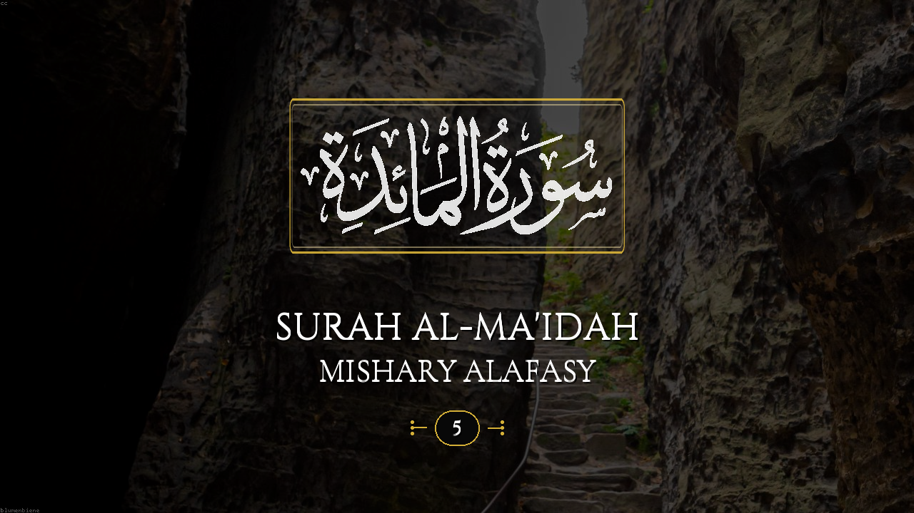

# Quranic YouTube Thumbnail Generator

I built this to make cinematic YouTube-style Quranic recitation thumbnails — 1280×720 by default, exportable up to 4K. Pick a surah and I auto-fill the Arabic name, English title, and number. You can style the text, pick nature backgrounds, add optional corner banners or transparent name frames, overlay a reciter photo, drag everything into place, and batch-export a whole series.


### Sample output — Surah Al-Ma'idah



*Example export: `005_Surah_Al-Ma'idah.png`. Preview above is 1280×720; you can export Full HD or 4K from the app.*

---

## Install (Windows — easiest way)

You do **not** need Python for this.

1. Download **`QuranThumbnailGenerator-Setup.exe`** from the [Releases](../../releases) page (or build it yourself — I explain that below).
2. Run the installer and follow the wizard.
3. Open **Quran Thumbnail Generator** from the Start Menu (I included an optional desktop shortcut in the installer).

Everything is bundled — Pillow, PyMuPDF, fonts, banners, and scenery. On first launch the app may download extra background images if they were not in your build; that only needs internet once.

I save your settings, custom banners, and reciter photos here:

`%LOCALAPPDATA%\QuranThumbnailGenerator`

---

## Install from source (run or hack on the code)

You need **Python 3.10+** on Windows. When you install Python, tick **Add Python to PATH**.

1. Clone my repo:

   ```powershell
   git clone https://github.com/ArthurVlade/Quranic-Youtube-Thumbnail-Generator.git
   cd Quranic-Youtube-Thumbnail-Generator
   ```

2. Double-click **`setup.bat`**.  
   It creates a virtual environment, installs dependencies, and downloads fonts, banners, scenery, and the app icon. The full scenery library takes a while — let it finish.

3. Launch anytime with **`run.bat`**.

That is all you need locally. If you prefer the terminal, see [Manual setup](#manual-setup-any-os) below.

---

## Build the installer yourself

If you want to ship **`QuranThumbnailGenerator-Setup.exe`** to others:

1. Install [Python 3.10+](https://www.python.org/downloads/) and [Inno Setup 6](https://jrsoftware.org/isdl.php).
2. Clone the repo and run **`build_installer.bat`** once.
3. Pick up the output at:

   `Output\QuranThumbnailGenerator-Setup.exe`

That script installs build tools, prepares assets, bundles the app with PyInstaller, and compiles the Inno Setup installer. Share that single file — nobody else needs Python.

### Portable folder (no installer wizard)

If you only want a folder you can copy around:

1. Run **`setup.bat`**, then **`build.bat`**.
2. Copy **`dist\QuranThumbnailGenerator\`** anywhere and run **`QuranThumbnailGenerator.exe`**.

---

## Quick start

Once the app is open:

1. **Surah** tab → pick a surah (I fill names and number for you).
2. Set your **reciter name** and tweak **Style** (sizes, colors, glow).
3. **Background** tab → filter by Forests, Mountains, Lakes, etc., or hit **Random scenery** / **Fetch fresh (online)**.
4. **Style** tab → optionally pick a **Surah name container** (frame around Arabic only; English title, reciter, and badge stay below).
5. Drag the colored tabs on the preview to move each layer, or drag the canvas to move the whole block.
6. **Export** tab → HD / Full HD / 4K → **Export PNG** (`Ctrl+S`) or **Batch export** (`Ctrl+E`).

Corner banners are off by default. Turn them on under **Banners** if you want the Islamic corner ornaments.

---

## What you get

- **Stylized surah names** — high-resolution SVG (3× supersampled) for all 114 surahs from Amrayn
- **Surah name containers** — 32 transparent outline frames; resize them in the preview without changing Arabic size
- **HD / Full HD / 4K export** — 1280×720, 2560×1440, or 3840×2160
- **Independent text layers** — move Arabic, English title, reciter, and badge separately
- **500+ categorised nature backgrounds** — Forests, Mountains, Lakes, Springs, and more
- **Fetch fresh scenery** — pull a new random image on demand
- **Resizable corner banners** — classic and geometric styles; upload your own PNG
- **Reciter photo overlays** — save collections and drag portraits onto the thumbnail
- **Batch export** — export a range of surahs with a progress bar
- **Modern dark UI** — custom title bar, taskbar icon, settings that persist

---

## Keyboard shortcuts

| Shortcut | Action |
|----------|--------|
| `Ctrl+S` | Export PNG |
| `Ctrl+E` | Batch export |
| `Ctrl+R` / `F5` | Refresh preview |
| Arrow keys | Nudge the text block |
| Double-click a handle | Reset that element |

## Preview handles

| Handle (left edge) | Moves |
|--------------------|--------|
| Blue **SVG** | Arabic surah name |
| Yellow **Title** | English title |
| Green **Reciter** | Reciter name |
| Gold **Badge** | Surah number badge |
| Drag elsewhere on preview | Whole text block |
| Gold dashed box | Reciter photo overlay |

Hover a name container in the preview for **↔ width**, **↕ height**, and **⧉ uniform padding** handles.

---

## Manual setup (any OS)

If you skip `setup.bat`:

```bash
python -m pip install -r requirements.txt
python setup_fonts.py
python setup_backgrounds.py
python generate_banners.py
python generate_name_containers.py
python setup_reciter_photos.py
python make_icon.py
python app.py
```

To refresh or expand the scenery library later:

```bash
python setup_backgrounds.py
python clean_backgrounds.py
```

---

## What I used to build it

| Library | Role |
|---------|------|
| **Pillow** | Image composition and PNG export |
| **PyMuPDF** | Renders Amrayn SVG surah names (no Cairo on Windows) |
| **arabic-reshaper** + **python-bidi** | Arabic shaping and direction |
| **tkinter** | GUI (included with Python) |
| **PyInstaller** | Standalone `.exe` (build only) |
| **Inno Setup** | Windows installer (build only) |

---

## Project layout

| File | What it does |
|------|----------------|
| `app.py` | Main GUI |
| `thumbnail_generator.py` | Renders thumbnails (scale-aware for HD/4K) |
| `preview_canvas.py` | Draggable live preview |
| `surah_svg.py` | Fetches and rasterizes surah SVGs |
| `name_containers.py` | Ornate frames around the Arabic name |
| `win_chrome.py` | Custom title bar + taskbar on Windows |
| `app_paths.py` | Paths for source vs installed `.exe` |
| `settings_store.py` / `reciter_store.py` | Saved settings and reciter data |
| `setup.bat` / `run.bat` | One-time setup and launch |
| `build.bat` / `build_installer.bat` | Build portable app or Setup.exe |
| `assets/samples/` | Example exports (including the README preview) |

---

## Troubleshooting

**Preview is blank or options do nothing**  
Run `setup.bat` again so fonts and banners exist. Check that `assets/fonts` and `assets/banners` are populated.

**Background list is empty or small**  
Run `python setup_backgrounds.py` (or full `setup.bat`). I do not commit the full background library to git — you generate it locally after clone.

**Taskbar shows the Python icon when running from source**  
That is normal for `run.bat`. The installed `.exe` uses my app icon.

**Want the normal Windows title bar**  
Add `"native_titlebar": true` to `data/settings.json`.

---

## Pushing your own changes to GitHub

If you forked or cloned this and want to push commits:

```powershell
cd "C:\Users\Avalon Absolute\Projects\quran-thumbnail-generator"

git status
git add README.md assets/samples/ app.py win_chrome.py
git add -u
git status

git commit -m "Describe what you changed"

git push origin main
```

Swap `main` for your branch if needed (`git branch` shows it).

If `git push` says *Everything up-to-date* but you expected new commits, you still need `git add` and `git commit` first — `git status` will show what is unstaged.

I gitignore large generated folders like `assets/backgrounds/`. Do commit `assets/samples/` so the README preview image loads on GitHub.

---

If something breaks or you want a feature, open an issue — I am happy to keep improving this.
